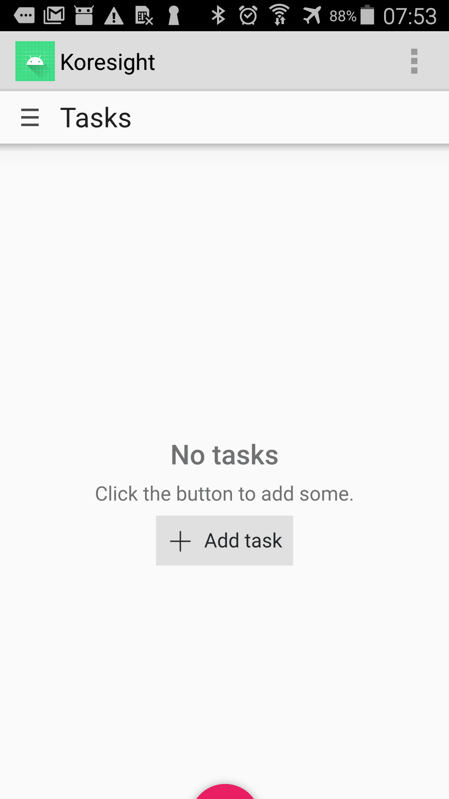
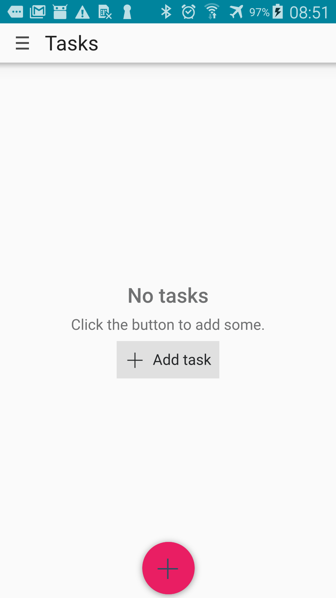

# Porting issues

## Menu button

By default, if your app has a global menu bar, which Qt turns into a menubutton menu, it will be displayed as an [ActionBar](http://web.archive.org/web/20110225055703if_/http://developer.android.com/guide/topics/ui/actionbar.html). See [the blog post about menubuttons](https://android-developers.googleblog.com/2012/01/say-goodbye-to-menu-button.html) for more information.

This will lead to undesirable side effects:



However, we can fix this by adding `android:theme="@android:style/Theme.DeviceDefault.NoActionBar"` in the `<application>` tag to our `AndroidManifest.xml`.

If you're using KAppTemplate and haven't modified the manifest yet, the `<application>` tag should look like this:

```xml
<application android:name="org.qtproject.qt5.android.bindings.QtApplication" android:label="Koresight" android:icon="@drawable/logo">
```

Change it to this:

```xml
<application android:name="org.qtproject.qt5.android.bindings.QtApplication" android:label="Koresight" android:icon="@drawable/logo"
             android:theme="@android:style/Theme.DeviceDefault.NoActionBar">
```

Now your action bar will disappear. If you have an old device with a menu button, the menu should still show up.

